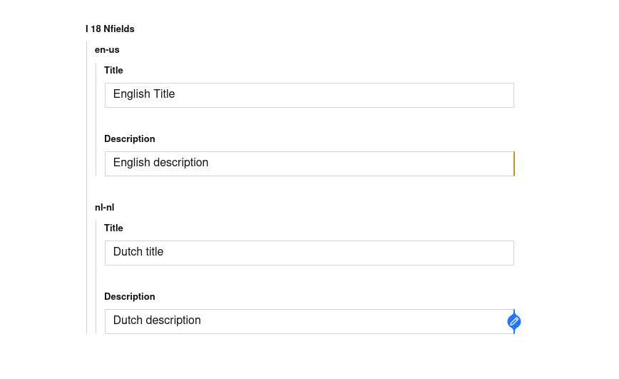
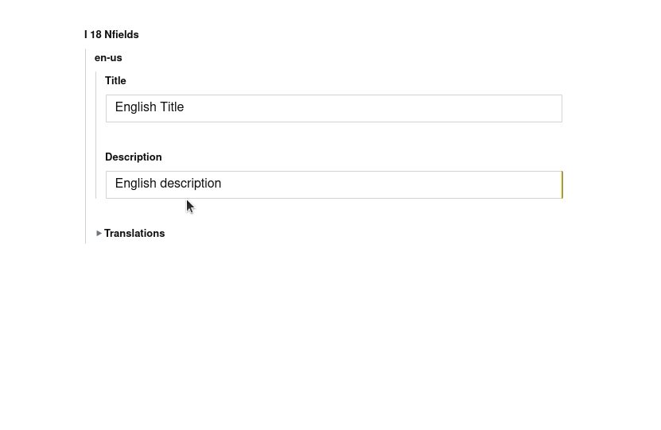
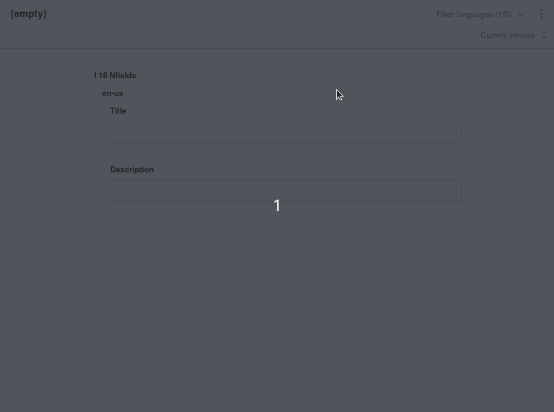

# Object Level Translations Migration
As mentioned in the README, the object level translations will be deprecated in the new "Official" translation plugin from Sanity. When you migrate to the new plugin and want to keep your object level translations you will need to follow the following steps to match their [offical guidance](https://www.sanity.io/docs/localization#cd568b11a09c) on this form of localization.

## Current situation
For this migration guide, let's assume we are starting from the following configuration.

**config/intl-input.json**
```json
{
    "idStructure": "subpath",
    "referenceBehavior": "hard",
    "languages": ["en-us", "nl-nl"],
    "base": "en-us"
}
```

**schemas/homepage.js**
```js
export default {
  type: 'document',
  name: 'homepage',
  title: 'Homepage',
  fields: [{
    name: 'i18nfields',
    type: 'object',
    fields: [{
        type: 'string',
        name: 'title',
    }, {
        type: 'string',
        name: 'description',
    }],
  }]
}
```


## Updating the schema with pre-defined language fields
As described in the [official guide for field level translations](https://www.sanity.io/docs/localization#cd568b11a09c), we should define the localized fields as separate objects. The easiest way to go about this for our example situation would be as follows.

First of all let's move the `i18nfields` object to a separate object type using our existing language configuration. For simplicity we will be re-using the existing `intl-input` config.  

*Keep in mind field names can not contain dashes (`-`) so we will be replacing them with underscores (`_`). The plugin currently does this for you*

**schemas/homepage-i18nfields.js**
```js
import i18nconfig from 'config:@sanity/document-internationalization';

export default {
  type: 'object',
  name: 'homepage-i18nfields',
  fields: i18nconfig.languages.map((lang) => ({
    title: lang,
    name: lang.replace(/-/g, '_'),
    type: 'object',
    fields: [{
        type: 'string',
        name: 'title',
    }, {
        type: 'string',
        name: 'description',
    }],
  })),
}
```

Having added your new type, you can now reference it in your `homepage` schema.

**schemas/homepage.js**
```js
export default {
  type: 'document',
  name: 'homepage',
  title: 'Homepage',
  fields: [{
    name: 'i18nfields',
    type: 'homepage-i18nfields',
  }]
}
```

The resulting studio should look something like this


This works but we can do better and improve the UI a little.

## Option 1: Improving the UI using fieldsets
One solution is fieldsets. Using this option we will be able to initially "hide away" the translated fields to achieve a cleaner experience.

To do this we will need to update our `homepage-i18nfields` schema:
**schemas/homepage-i18nfields.js**
```diff
import i18nconfig from 'config:@sanity/document-internationalization';

export default {
  type: 'object',
  name: 'homepage-i18nfields',
+ fieldsets: [{
+   title: 'Translations',
+   name: 'translations',
+   options: { collapsible: true }
+ }],
  fields: i18nconfig.languages.map((lang) => ({
    title: lang,
    name: lang.replace(/-/g, '_'),
    type: 'object',
+   fieldset: lang === i18nconfig.base ? null : 'translations',
    fields: [{
        type: 'string',
        name: 'title',
    }, {
        type: 'string',
        name: 'description',
    }],
  })),
}
```

Great! Our final UI will look something like this:


## Option 2: Improving the UI using @sanity/language-filter
Fieldsets are not the only way we can improve the Studio UI, we can also opt for the [`@sanity/language-filter` plugin](https://www.npmjs.com/package/@sanity/language-filter). Let's set it up and see what this solution would look like.

For this option, we do not need to set-up any fieldsets, so if you had already you can remove them.

First thing you will need to do is to install the plugin. You can do this by automatically with the Sanity CLI by running `sanity install @sanity/language-filter` or you can install it using NPM or Yarn. If you opt for the latter, make sure to also add the plugin in your `sanity.json` file.

```diff
{
    ...
    "plugins": [
        ...,
+       "@sanity/language-filter"
    ],
    "parts": [
        ...
    ]
}
```

After installing the plugin we will need to configure it. This is done by implementing a new Studio part. Here's a full example for our demo situation.

**parts/languageFilterConfig.js**
```js
import i18nconfig from 'config:@sanity/document-internationalization';

export default {
  supportedLanguages: i18nconfig.languages.map((lang) => ({
    id: lang.replace(/-/g, '_'),
    title: lang,
  })),
  defaultLanguages: [i18nconfig.languages[0].replace(/-/g, '_')],
  documentTypes: ['homepage'],
  filterField: (enclosingType, field, selectedLanguageIds) => {
    return (
      enclosingType.name !== 'homepage-i18nfields'
      || selectedLanguageIds.includes(field.name)
    );
  }
}
```

**sanity.json**
```diff
{
    ...
    "plugins": [
        ...
    ],
    "parts": [
        ...,
+       {
+           "name": "part:@sanity/language-filter/config",
+           "path": "./parts/languageFilterConfig.js"
+       }
    ]
}
```

That's it! Now we should see a dropdown in the header of the document where you can select which languages you want to display.


## Final words
That's the basics of migrating to the new plugin. If you have any questions or need help migrating specific configurations, feel free to make an [Issue](https://github.com/LiamMartens/sanity-plugin-intl-input/issues/new) or reach out in the [Community Slack](https://slack.sanity.io)